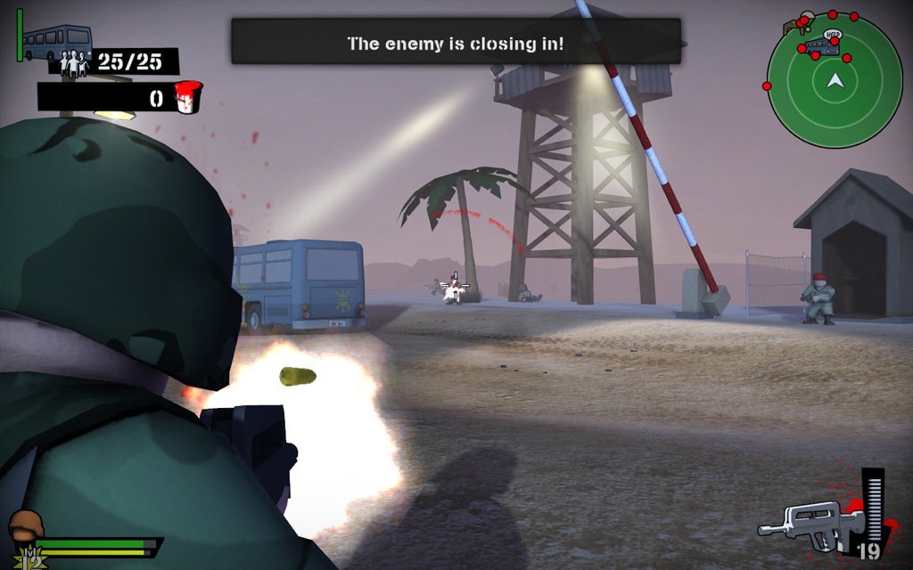

After six intense months of development, the game I've been pouring my energy into has finally been [released on Steam](https://store.steampowered.com/app/36000/Foreign_Legion_Buckets_of_Blood/)!

Foreign Legion: Buckets of Blood is a fast-paced, stylized third‑person shooter. Missions range from defending an oil pipeline against waves of attackers to escorting a bus packed with tourists through hostile territory.

_I created most of the levels and 3D environment art._

_The dawn escort mission is one of the prettier levels I built._

We built the game on [Unity 2.6](https://unity.com/) as our engine, with all characters, weapons, and environment assets modeled in [Blender 2.49](https://blender.org/). I had already been experimenting with Unity, but the arrival of the Windows version in March motivated everyone [at the studio](https://sakarigames.be/) to tackle a small, focused project together. I drafted a quick design document while everyone else got familiar with the technology.

_Early iterations of the third‑person character controller back in March._

We soft‑launched a Mac version in July, only a few months after starting development, and were promptly featured in Apple's top downloads for the month. The Steam release took longer: Unity didn't have Steamworks integrations yet, so we built our own and polished the game further along the way.

_Featured at 9th place in Apple's top downloads._

We also shipped a browser version via the Unity web player on Netlog, a Belgian social media platform, as one of the launch titles for their gaming hub. They are the first platform to adopt microtransactions in Europe, the game is free to play with guns and ammunition available for purchase. I'm not a fan of that business model, but time will tell.

_Local newspaper coverage of the Steam release and our presence at GDC._

Right now I'm prototyping levels for the upcoming multiplayer update using the "orange box" technique popularized by Valve. We're also in early talks with Sony about a potential PlayStation 3 version, which would be _really_ cool.

_Grey and orange boxes block out geometry, scale, and flow quickly._

Our studio had a small booth this year at GDC, the [Game Developers Conference](https://gdconf.com/) in Cologne, Germany. A highlight was chatting with Nicholas Francis, one of Unity's founders, he seemed genuinely proud seeing indie teams push his engine. Also, shout‑out to the many enthusiastic game dev students from the University of Gothenburg, Sweden!

_Me, second from the left, sharing stories with other developers at GDC._

Building Buckets of Blood in just a few months reminds me of the early [id Software](https://idsoftware.com/) days, Wolfenstein 3D was built in only four. Creating small games with a tiny, motivated team is hectic, but a lot of fun.
