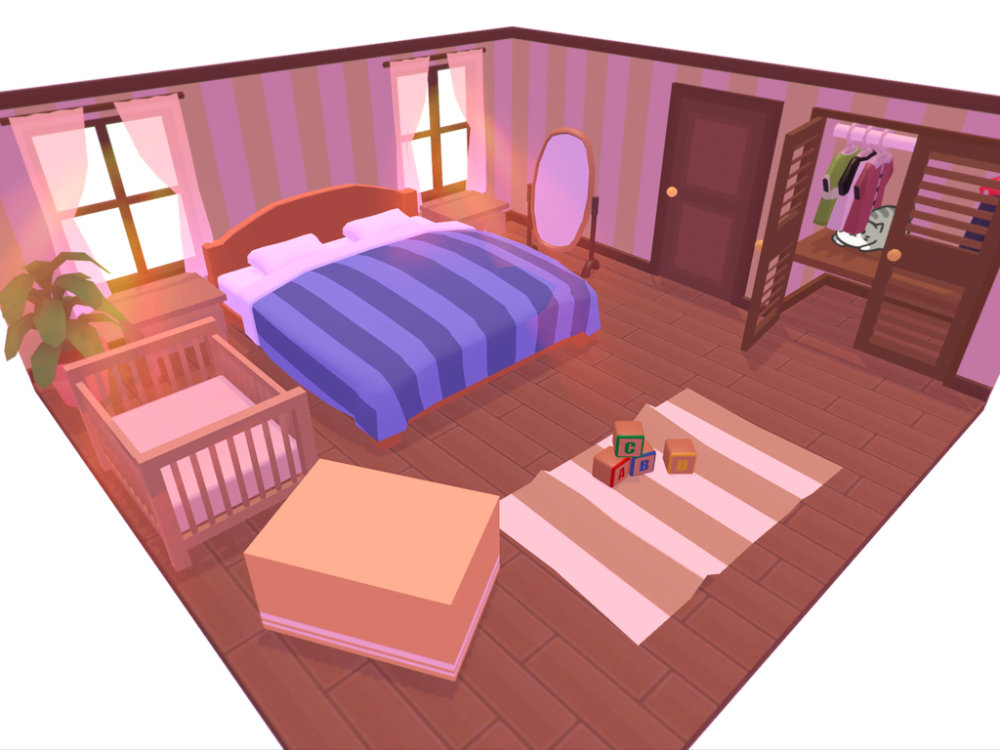

My second mobile game is officially out on iOS, grab it on the [App Store](https://itunes.apple.com/us/app/hidden-kitty/id1260323077?mt=8)!

Hidden Kitty is a cute seek‑and‑find game. Explore the rooms of the house and figure out where the kitty is hiding. Behind a pillow? Inside a cupboard? Tap and slide things around to discover new spots.

_There's lots of objects in the house to interact with._

This summer I wanted to build something smaller and cute than what I was already working on. Unlike my previous mobile game [Pilot Express](/posts/pilot-express-mobile-game-release), which was free‑to‑play, Hidden Kitty is a paid download, something I'd been wanting to explore for a while.

_Figuring out how to decorate the scenes was the biggest challenge._

There are four rooms to explore, each filled with interactive objects: pillows slide aside, cabinet doors swing open, balls roll away when tapped. Most of this doesn't serve much purpose really, but that's the nature of these games. The idea came from one of my childhood favorites: [Busy People of Hamsterland](https://www.youtube.com/watch?v=cyCwm-H58R8).

_I was happy with the sunlight effect through the windows, just simple sprite billboards._

I imagined parents buying this for their kids, so I focused on iPad performance and a kid‑friendly interface. There's no third‑party advertising or in‑app purchases, generally a better fit for this audience.

_Sliding open the shower curtain to reveal the kitty hiding in the bathtub was one of my favorites hiding spots in the game._

The game runs on the Unity engine. I wrote all the gameplay code in C#, and modeled every 3D asset in Blender with mobile performance in mind. Only a few objects use textures to make them stand out; most are flat‑shaded for that cartoony style.

The kitty itself is a 2D sprite, which helps it stand out excellently in 3D scenes, and frankly looks better than a low‑poly model would. Although the sprite clipping through geometry at times when rotating the camera was a hassle to deal with.

I've already received a few reviews from parents saying it's exactly what they were looking for and that their kids play it daily. That's more than I hoped for from this little project.
