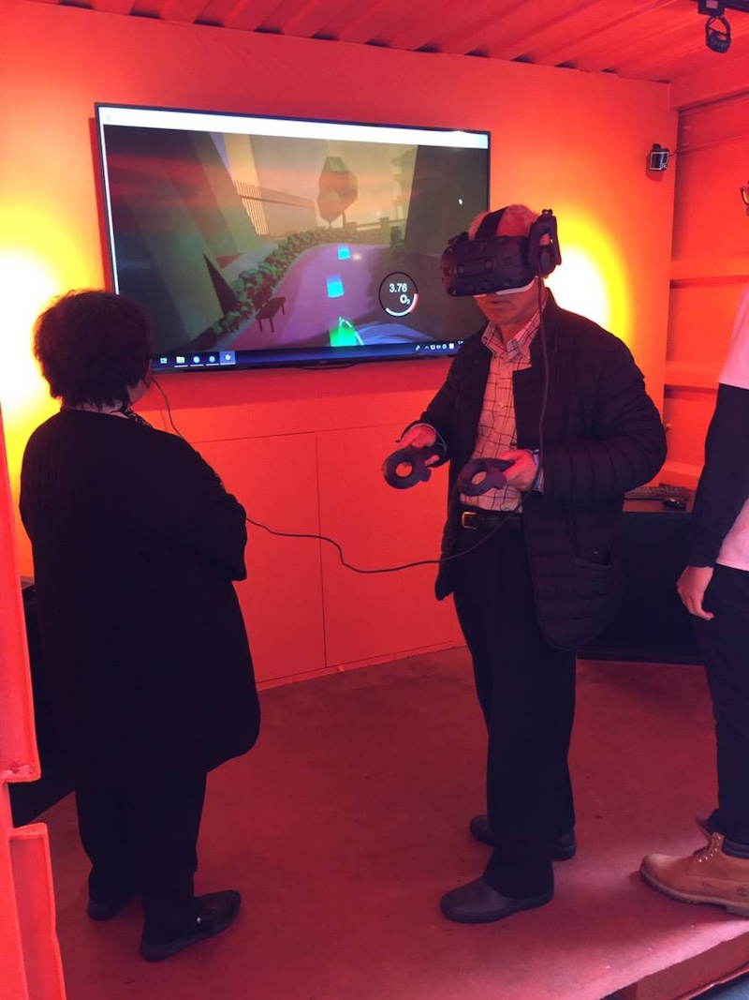
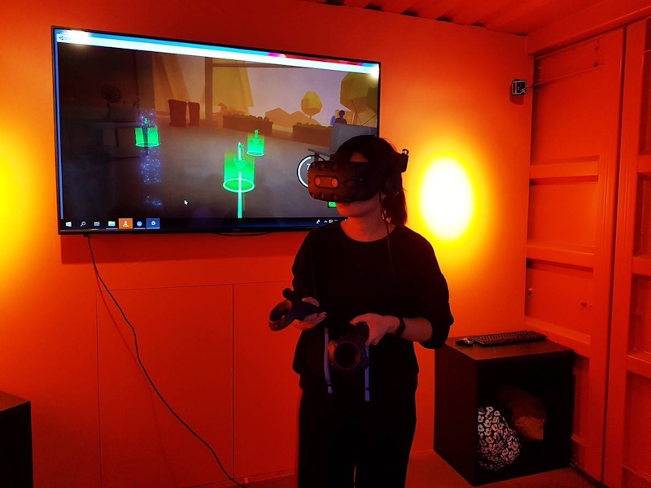
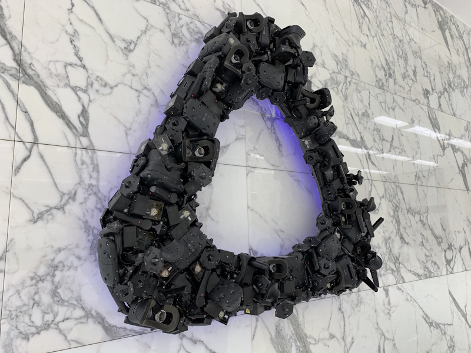
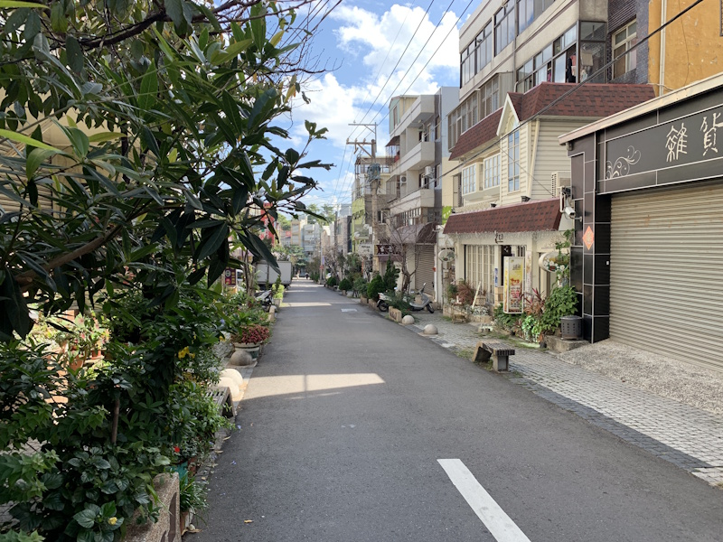
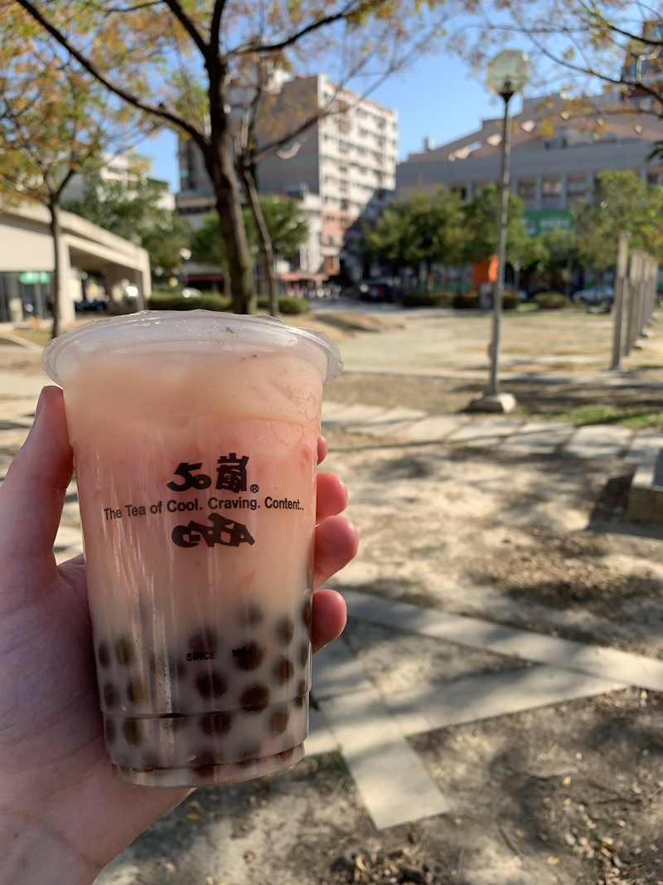

I've been active in the VR community for a while, being one of the original kickstarters for the Oculus DK1 VR headset. I was totally sold on the tech since E3 2012, thanks to [John Carmack's Doom 3 ski goggles tech demo](https://www.youtube.com/watch?v=GVDXXfbz3QE). I've owned about every Oculus headset and dev kit since then.

This eventually led to a fun contract with HTC, the Taiwanese electronics giant behind the HTC Vive. In collaboration with Taiwanese filmmaker Poke Poke Creative, we built a small VR game to raise awareness of [the Air Quality Index (AQI)](https://en.wikipedia.org/wiki/Air_quality_index) and Taiwan's pollution problem, an issue tied to the country's massive electronics manufacturing.

_The game was set-up in containers during an awareness campaign in Taipei, Taiwan._

You move through districts of a dark, polluted city. Each area is shrouded in thick smog; armed with a special device, you vacuum chunks of it away with a satisfying thump. Clear a district and you're rewarded with a projected video inside the VR space that dives deeper into the pollution issue.

It's sort of an interactive museum piece, really.

_Both young and old came to experience the VR game._

_Players move between green waypoints, which helps prevent motion sickness._

After a few months of development, I had the luxury of travelling to Taiwan and visiting HTC's headquarters to demo the project. Once the project received approval, the VR experience was exhibited to the public during an awareness campaign, where anyone could come and try it.

_The HTC office had a Vive logo made from old VR hardware, neat!_

One of the biggest challenges was not knowing the final hardware target before I came to Taiwan. VR games render the scene twice, once per eye, so about half of development went into pre-optimisation. Stuttering and low frame rate are the primary causes of motion sickness, especially for first time users.

_Taipei at night is a photography heaven, if you're into that kind of thing._

On the optimisation side, Unity's occlusion culling and LODs did the heavy lifting. I baked occlusion data for the city blocks so the GPU only drew what the camera could actually see, and used LOD Groups plus static batching/instancing to keep draw calls down. Combined with the portal system, that kept frame times stable.

It's the sort of project I look back on and mostly see what I'd improve. Still, I'm proud of what we accomplished.

_Taiwan is still beautiful and warm during december, not nearly as dark as the game._

_One last Yakult & grapefruit bubble tea, before flying back home to Belgium._