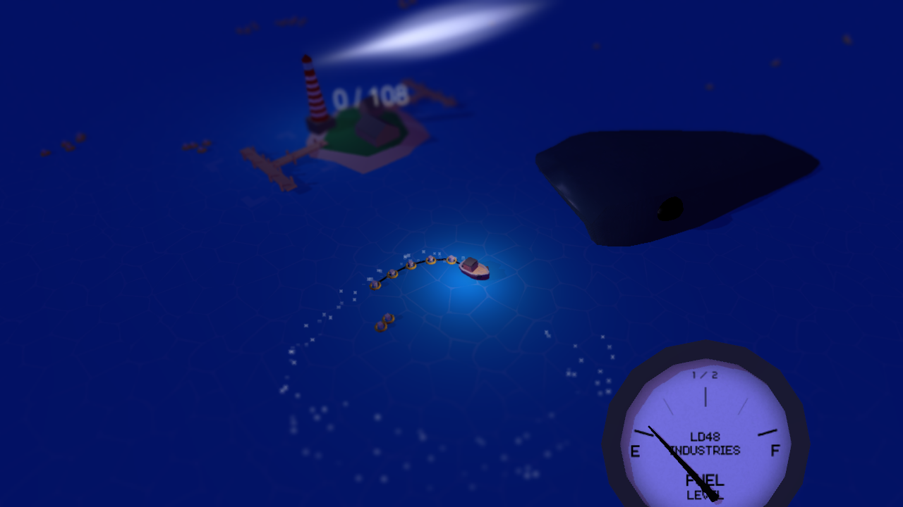

Ludum Dare #29 ran from April 25th – 27th, a 48-hour jam where anyone builds a game around a single theme. Unlike the Global Game Jam, it's common to work solo.

With the theme "Beneath the Surface", I set out to make a game about a giant monster lurking in the depths, part sandworm from Frank Herbert's "Dune", part Moby-Dick.

I started with a seafaring concept: you sail around collecting capsules drifting on the water. Other boats attack you, while the monster tries to swallow you whole. The game takes place at night, this helps to cover up any art assets look rough around the edges.

_By Saturday afternoon a rough version was playable._

Because I began late on Saturday, it became clear I had to cut features and lean harder into the theme.

Enemy boats and the weapon mechanic were stripped out first. Collectables became survivors adrift with safety buoys. Meanwhile, the monster stalks the player, waiting for a chance to gulp down the ship with as many survivors as possible. Why does the monster favour the ship over the survivors? Ships have more fibre.

To keep players from wandering too far or running into the edge of the world, I added a fuel mechanic. The tank refills when you return home, perfect for dropping off rescued survivors at the same time.

_By Sunday night the game had taken shape with colourful graphics._

I finished work around 3 AM on Monday morning and submitted the build, just under the deadline. I'm happy with it. There are a few minor bugs and plenty I could improve, but that's the charm of a game jam.

The game runs on the Unity engine, with all of the game code written in C#. For the 3D models, I used Blender, and generated all the sound effects with [BFXR](https://bfxr.net/).

So far the reviews are very positive. You can [download the game and check out the source code on the Ludum Dare entry page](https://ludumdare.com/compo/ludum-dare-29/?action=preview&uid=14952).