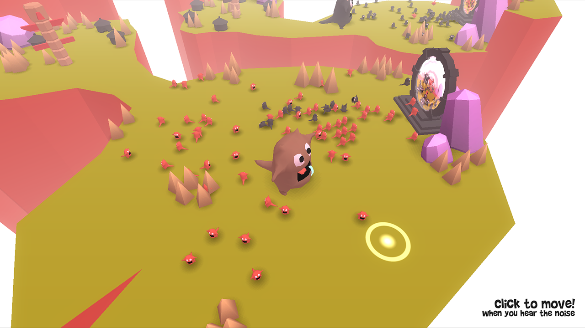

Ludum Dare is a fantastic challenge: [make a game from scratch in 48 hours](https://ludumdare.com/). Every year more people join, resulting in thousands of entries by the end of the weekend. This was my second time participating.

Running into time-wasting problems is dangerous when you only have two days. Preparing before you start is key. While there's some value in learning new software under pressure, it's better to use tools you already know: the C# programming language, Blender, and Unity in my case. Prepare your work environment before the weekend starts. I set up [Chronolapse](https://code.google.com/archive/p/chronolapse/) to capture [a timelapse](https://www.youtube.com/watch?v=PuTk-GsvBXs) and OBS for livestreaming on Twitch. Avoid nasty surprises once you start, nothing derails a jam like broken software.

## Saturday – Stuck

With the theme "Connecting Worlds" I set out to make a small twin-stick shooter. Monsters would attack through portals from other worlds that you can jump through. After a few hours, I wasn't feeling it.

I spent most of Saturday exploring ideas and building quick prototypes. Luckily, people watching my livestream (something I wasn't used to) kept me motivated. Having an audience watch your every move is both daunting and energizing.

By Saturday night I'd found a visual style I liked. I checked [George Broussard's](https://twitter.com/Georgeb3dr) stream from time to time, super fun. Talking with others going through the same crazy weekend helps keep you sane. The "Share on Twitter" button was a trick I picked up from George; I include it in all my mobile games now.

_Herding your little monsters into the portal, towards the rival village._

## Sunday – Build It

On Sunday morning I started to pin down the gameplay. I kept polishing the environment, but it wasn't until evening that the core loop clicked: two islands attacking each other, with a giant monster defending its village. I wrote most of the fundamental gameplay code during the final hours.

_Keeping the pesky rival tribe out of your village didn't feel as responsive as I wanted._

The key asset in game development is knowing all the quick & dirty tricks. Take the giant for example: I started rigging and animating but became nervous knowing how time‑consuming animation can be. After wrestling with animation rigs and bone weights, I simply animated all the monsters by code instead, just rocking them back and forth on a sine wave. Those little math tricks save a ton of time.

Most of the code from the last six hours is pretty horrifying. Despite that, the game appears to be glitch‑free. You go into Ludum Dare assuming your code is throwaway, so it doesn't really matter.

_The portals turned out really well, flinging monsters to the other side as they step through._

## Monday – Ship It!

Because of time zones, the deadline lands a bit differently for everyone. For me, it was 3 AM on Monday. With two hours to spare and gameplay working well enough, I used Unity 4.6's new UI system to set up a menu with game instructions.

It's easy to forget how long it takes to submit the final build of a game: adding screenshots, writing descriptions, even coming up with a title. As the deadline crept up, I discovered the Mac build was crashing, too. The final hours are always chaos, but I got lucky and found a quick fix.

I sank ~32 hours into development and I'm pleased with the result: about 1,000 lines of code, different character models, a handful of environment props, and a few sounds generated with BFXR. Some mechanics, such as the rhythmic movement of the monsters, aren't what I hoped for; after plenty of tweaking, they still don't feel right. I'm considering turning it into a full game, and I'll revisit the mechanics then.

If you're interested in game development, just try to make a game. If you're having trouble finishing one, Ludum Dare is perfect.

You can [download the game](https://ludumdare.com/compo/ludum-dare-30/?action=preview&uid=14952) or [watch the timelapse instead](https://www.youtube.com/watch?v=PuTk-GsvBXs).