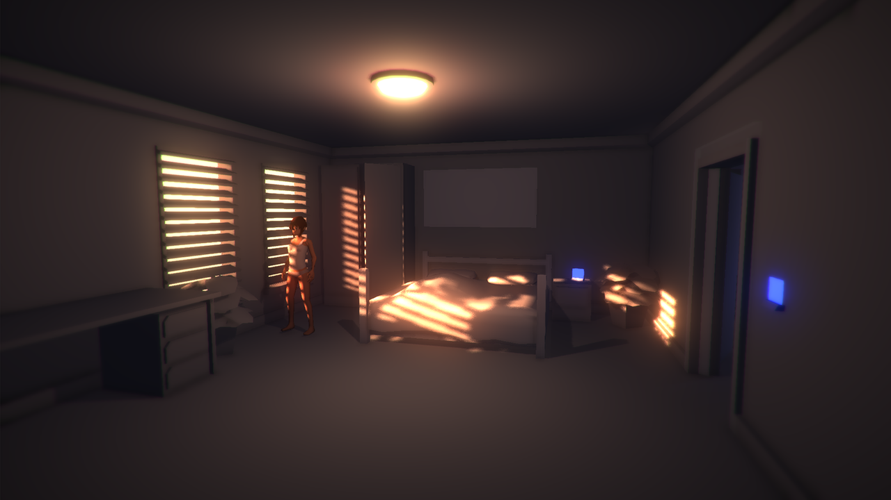

Compute Thought is a short cyberpunk point-and-click adventure game created for #Nar8, a narrative‑focused game jam. I usually lean toward gameplay and level design rather than writing, so this project was a deliberate exercise in story building. You can [play it on itch.io](https://merlijnvh.itch.io/compute-thought) or [browse the source code on GitHub](https://github.com/MerlijnVH/Compute-Thought).

_The opening scene is my favourite, but went through many iterations._

The game centers on a detective investigating the murder of a scientist, in a world where humans and androids coexist (uneasily). Classic cyberpunk stories like Blade Runner and Ghost in the Shell inspired me.

## Development

I initially tried to stage a dramatic outdoor crime scene: rain, reflective streets, harsh neon. What I pictured never matched what appeared on screen; the outdoor set felt empty, unfocused. After several attempts I pivoted to indoor spaces exclusively: tighter, more readable, easier to finish.

Originally the game flow was: character introduction, learn the interface, travel to the crime scene, burst through the door (pistol drawn) to confront the murderer. That last action sequence was cut later to keep scope under control; simplification let me ship a coherent vertical slice instead of an unfinished set piece.

_The first prototype, our detective standing over the body._

_The prototype grew into a night‑market scene which I later abandoned._

## Technical & Code

Implementing the point‑and‑click layer was the most fun. Hovering over an interactable object switches to a duplicate of the 3D mesh, but with an additive shader, offset slightly to create an animated parallax effect.

Clicking an object queues a pathfinding action to have the character walk over, then opens a dialogue window. All dialogue was authored in Twine for fast iteration. Each Twine file is assigned to an object in the editor.

_Scene management inside the Unity editor._

Late in development I added a computer terminal. This is where the detective investigates the crime scene and the victim's files. It accepts real keyboard input, plays tactile clicky typing sounds, validates input against a list of possible commands, renders text off‑screen on a texture, then draws it in the game world. There was groundwork for browsing around the full hard-drive that I couldn't flesh out before the deadline.

## Environment & Characters

All the assets were modeled in Blender, and lit in Unity using a strong directional light and bloom effects. A simple additive skybox help sell the glow coming through the windows. Most props were simply left flat‑shaded.

_The computer is placed close to camera in the finale to signal its importance._

Character work was hardest. I usually build "cute" stylized things, so a more life-like human posed a challenge. The walk cycle went through multiple iterations; it's still imperfect, and the slight slide from idle to walk cycle bothered me most, but it reached an acceptable level for the jam.

## In Closing

Building Compute Thought in roughly two weeks of spare time was satisfying. I probably wrote more words in this post than all of the game's dialogue, still plenty to learn on the narrative side. With more time I would have added more interactions and expanded on existing systems; for a story‑driven game, interactivity is thin.

As a first itch.io release it performed modestly: about eight plays a day, fine for a game jam entry and likely more than my Ludum Dare #29 game.