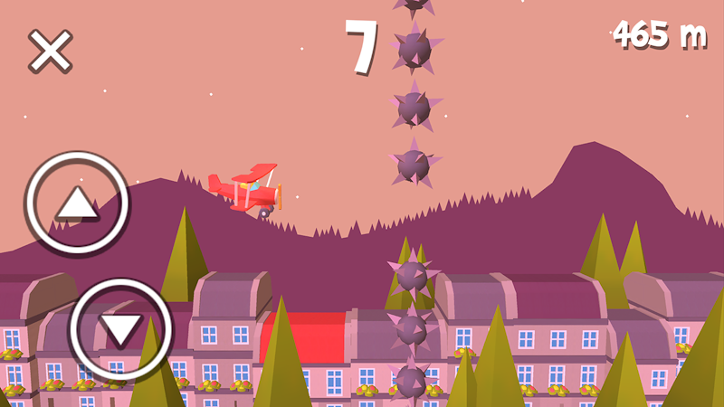
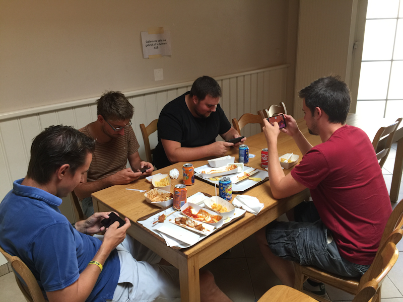

I've been working on a little mobile game this summer, which is finally released on both the [App Store](https://itunes.apple.com/us/app/pilot-express/id1023529050?mt=8) and [Google Play](https://play.google.com/store/apps/details?id=com.MithraGames.PilotExpress&hl=en)!

Pilot Express lets you fly a small plane up and down, avoiding obstacles such as mines and balloons along the way. Collect coins to increase your score and fly through hoops to gain a speed boost. The controls are simple and responsive, so the challenge comes from reacting quick enough, flying through tight gaps, and deciding when to go for the bonus items versus playing it safe.

_Fly through the gaps and avoid the deadly mines._

The original game design document centered on dropping parachute packages from the sky at just the right moment, timing, wind, and accuracy to drive the challenge. The ideas weren't working however, so the concept evolved into a faster infinite runner-type game. Delivery packages turned into collectible coins, and flying enemies turned into minefields that lure you into risk/reward situations.

Visually, the game leans hard into a low-poly cute and cartoony look: rounded forms, bright colors, and big shapes that read well on a phone screen. Everything was kept lightweight so it feels playful without sacrificing performance. The trees are just pyramids, and the entire mountain background is just one flat shape.

_Fly through the hoops to gain speed, boosting your score!_

I also created a few set pieces that simply loop infinitely in the background. The buildings are made from modular pieces and are assembled on-the-fly before you pass by, though there's probably not enough variation to really notice.

The game runs on the Unity engine, I wrote all the code in C#, and every 3D asset was modeled with Blender and optimized for mobile. What started as a small summer prototype turned into a fun little project where I handled design, art, development and released the game a month later.

The game is free to play, but uses Unity Ads to display a video advertisement everytime you crash the plane.

The goal of the game is simple and straightforward: beat your highest score and fly as far as possible without crashing. In the future, I'd love to add unlockable planes with different handling, more scenery to keep runs fresh, and a few extra surprises to reward mastery of the game. If you give it a spin, I'd love to hear your feedback!

_My coworkers trying hard to beat each other's high score after a big lunch._
