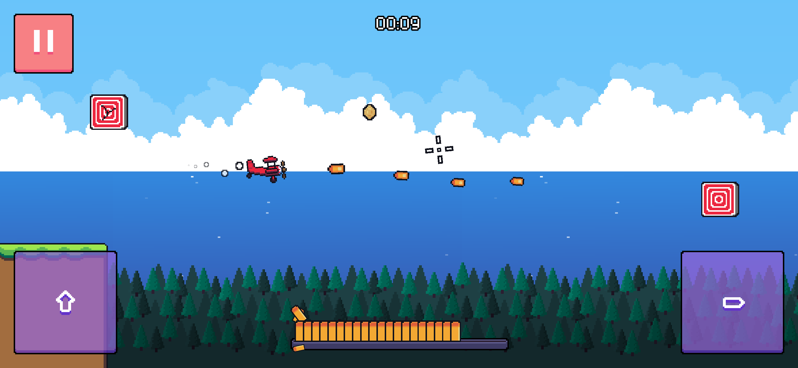
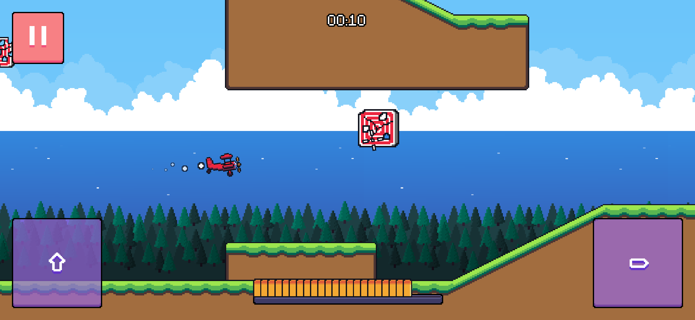

I've been working on a new mobile game, out today on [Google Play](https://play.google.com/store/apps/details?id=com.MithraGames.PilotPanic&hl=en)! The App Store version will follow soon. I had to hit an April deadline or my Google Play account would be closed for inactivity. Maintaining mobile games is... not always fun.

Pilot Panic is the successor to my earlier mobile game, [Pilot Express](/posts/pilot-express-mobile-game-release/). I originally built it in Unity, but I've been learning Godot over the past few months. Porting a previous game felt like the perfect learning opportunity, though I ended up rebuilding almost everything. The game is now fully 2D, which makes the gameplay clearer and, in my opinion, looks better than the old low‑poly 3D style.

_[Porco Rosso](https://www.youtube.com/watch?v=3LRyNwYg1f8) inspired me to have blue skies and fluffy white clouds everywhere._

It's no longer an infinite‑runner. Instead, you progress through 16 missions with a simple goal: shoot down all targets and collect all the gold coins. Some routes are tight and require precision, which makes completing a mission all the more satisfying.

_Shoot down all the targets to complete a mission._

I had a lot of fun improving how the plane feels. Rather than separate up/down buttons, there's now a single throttle. The plane naturally descends; holding throttle increases speed and lifts you back up. That continuous  rise‑and‑fall keeps you engaged and makes navigation more challenging (in a good way, hopefully).

_The targets are found in tighter spaces each mission._

I'm also proud of the shooting mechanic. Bullets visibly pop out one by one in the UI and reload back into the magazine after a short delay. Lining up shots while keeping the plane stable is, by far, the toughest skill to master in the game.

_No need to land the plane, just make it to the finish line!_

A bigger update with many new features and missions is coming to all platforms when I release the App Store version, keep an eye out!
