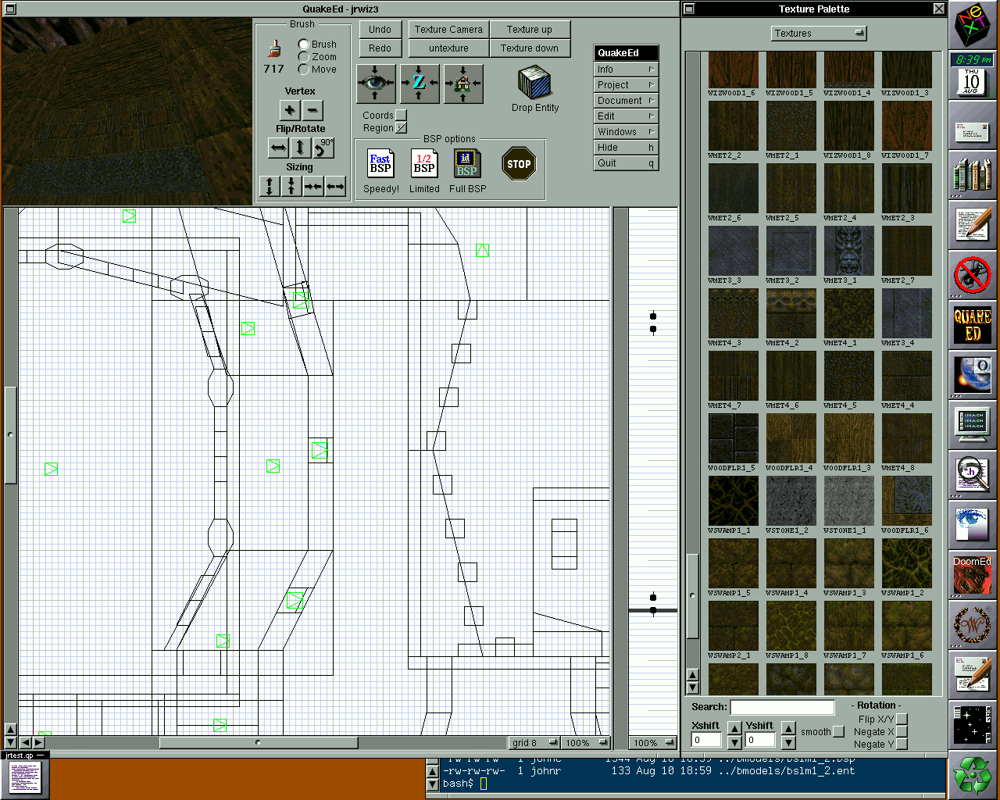

Today marks Quake's 25th anniversary, which also happens to coincide with my birthday.

Quake released on June 22, 1996. I was still in elementary school and I'm not entirely sure how I first got my hands on it, probably through my cousin, but my dad and I were instantly _hooked_ and played daily.

Quake wasn't just among the first fully 3D, real‑time‑rendered FPS games; it was executed so well that it still holds up today, and that quality is what makes it unforgettable.

One area it doesn't get enough recognition for (in my opinion) is its sound design. Even in a noisy, crowded room you could still pick out the moaning wails of zombies, the metallic cling‑cling‑cling of grenades bouncing off walls, and the juicy splatter of gibs afterward. The CD also shipped with [the atmospheric soundtrack by Nine Inch Nails](https://www.youtube.com/watch?v=eeNrRHty-Lo&list=OLAK5uy_mtGKX5UsqLx6KtLIwkBoRmi2FiToguw4s&index=1). Which was, lacking for better wording, totally rad.

Quake's development marks a hard time in [id Software's](https://idsoftware.com/) history. It was the last game co‑founder John Romero worked on at the studio. Continuous creative differences with John Carmack strained their relationship, and Romero's departure eventually led others, like Tom Hall, to move on as well.

A lesser‑known development element was QuakeEd, the level editor John Romero used to author all 32 maps. The studio was unusual in the industry for building tools on Steve Jobs' NeXT computers (running NeXTSTEP). Romero had written the DOOM editor as well (DoomEd) in Objective‑C on NeXTSTEP and branched it for Quake, replacing DOOM's 2D sector approach with true 3D BSP brush‑based level design: a system (and terminology) still common today.

One major upgrade over DoomEd was a 3D preview. Actual editing, though, still happened on front and side 2D grids.

_NeXTSTEP Operating System & QuakeEd, 1995_

The complexity to levels that 3D added posed a problem: more depth meant more brushes, and with the level file format capped at about 1.4 MB each map had to stay relatively small.

John Carmack decided that they could get more gameplay out of the levels if he slowed down the player's running speed. In DOOM the player went at crazy-fast speeds, and with huge levels the player speed wasn't a problem. With Quake's maps, the hallways, rooms, and outdoor areas were all smaller because of the file size. So slowing down the player meant it took longer to finish a level, and longer to finish the game overall.

There are so many interesting factoids about id Software and Doom/Quake's development, which made [Masters of Doom](https://en.wikipedia.org/wiki/Masters_of_Doom) one of my favorite books. If you're into that kinda thing, give it a read!