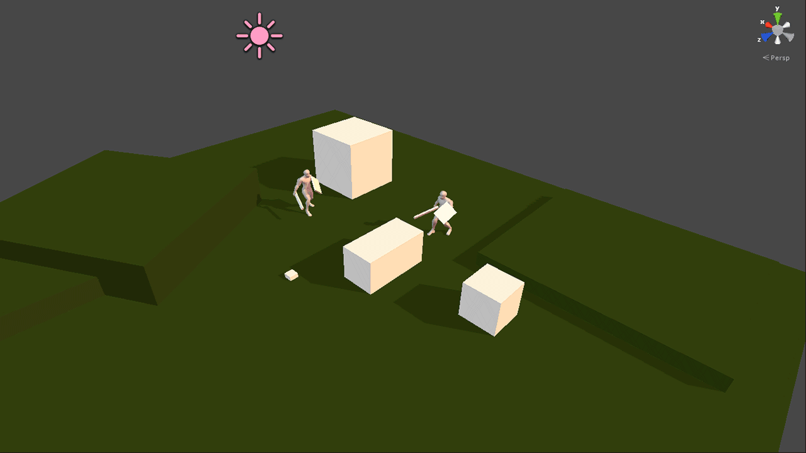

I spent a few days prototyping a turn-based tactical RPG, a genre I've grown to love. [X-COM: Terror from the Deep](https://store.steampowered.com/app/7650/XCOM_Terror_From_the_Deep/) hooked me when I was a kid, and only later did I truly come to appreciate it. It's great to see the genre making a comeback with titles like [The Banner Saga](https://store.steampowered.com/app/237990/The_Banner_Saga/) and [X-COM: Enemy Unknown](https://store.steampowered.com/app/200510/XCOM_Enemy_Unknown/).

As a proper tactical game, players choose their actions turn-by-turn: moving, attacking, or guarding. During the computer's turn, the AI identifies the nearest player character and moves in to attack. The battle ends when one side is defeated.

_The prototype has a functioning turn-based combat system on an auto-generated grid._

Grid-based is the tried-and-true approach, so that's where I started. I quickly blocked out a level in Blender using a tile set. Through code, the game computes a node grid for visualization and pathfinding: it calculates the level bounds, divides the area into nodes, and initializes all nodes high above the level. For each node, it raycasts downward: the first surface it hits determines where the node is placed.

_A visualization of raycasting downwards per grid cell and placing nodes._

These nodes serve as the foundation for the rest of the game logic. They enable A* pathfinding between points and allow the game to check whether a character can attack by inspecting surrounding nodes.

If I find some time next week, I'd love to create some graphics and add more features. For now, it's just a prototype.
